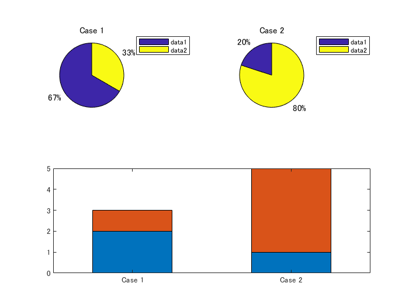
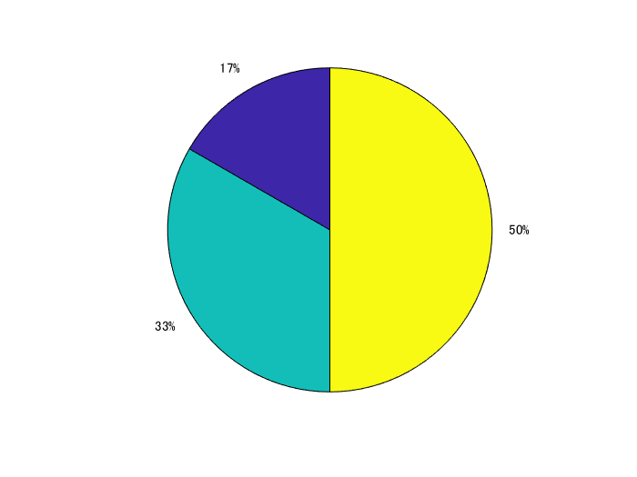
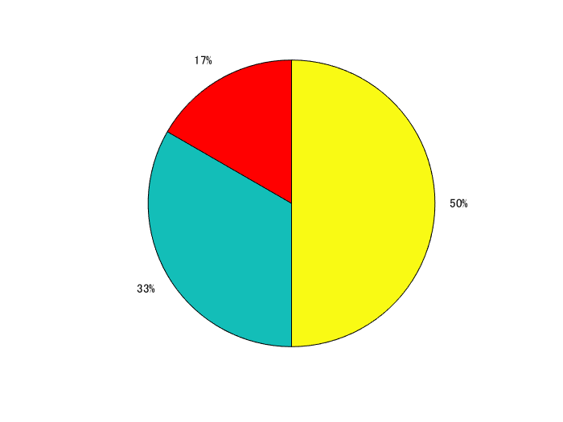
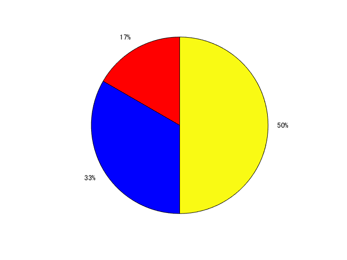
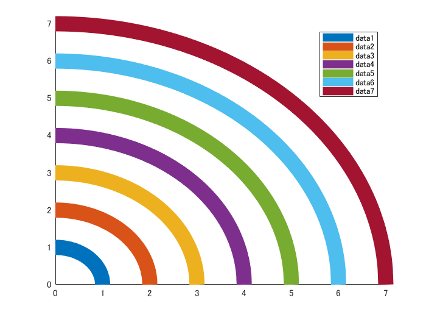
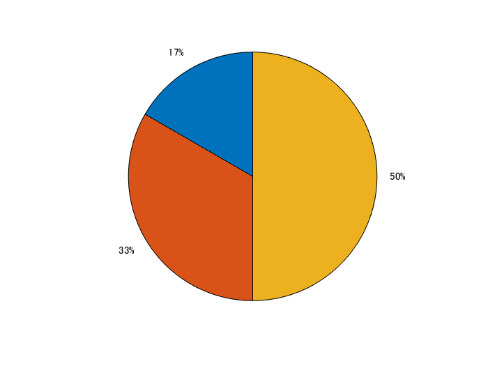
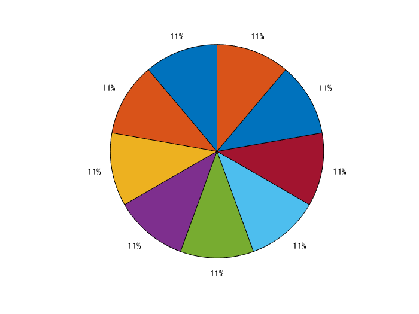
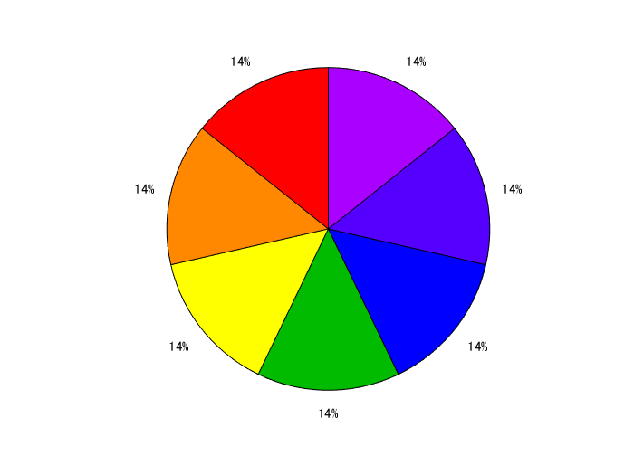
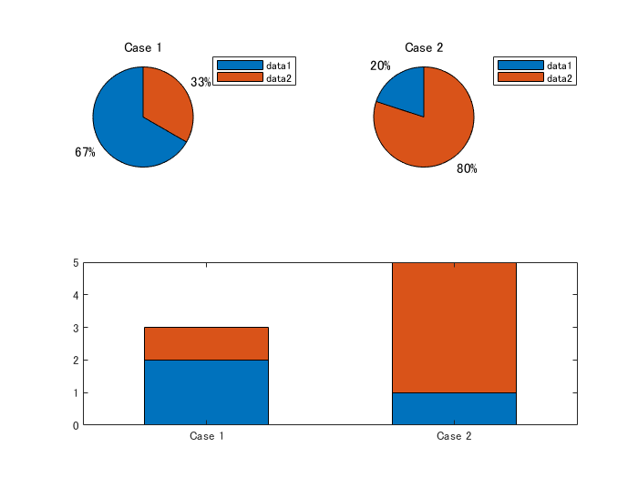

# 詳解：MATLAB の円グラフ（色設定）
Copyright 2021 The MathWorks, Inc.
# はじめに


円グラフ（パイチャート）を描く関数といえば [`pie`](https://jp.mathworks.com/help/matlab/ref/pie.html) 関数ですが、この投稿では少し深堀りして、


   -  円グラフは Patch と Text オブジェクトで構成されている 
   -  入力データの順で対応する Patch が並んでいる 
   -  色の指定はそれぞれの Patch の `FaceColor` プロパティを弄ればよい 
   -  デフォルトの色順の RGB 情報は `coloroder` で確認でき、変更も可能 


という点について紹介しています。MATLAB のグラフィックスオブジェクトを理解するネタになればうれしいです。参照：[グラフィックス オブジェクトの取り扱い](https://jp.mathworks.com/help/matlab/learn_matlab/understanding-handle-graphics-objects.html)


  


**利用環境**


   -  MATLAB R2020b 

# きっかけ


Twitter のフォロワーさんからこんな質問を頂きました。


同じデータを円グラフと棒グラフで表示したときの色を合わせたいんですけど・・。


```matlab:Code
Y1 = [2,1];
Y2 = [1,4];

figure
subplot(2,2,1);
pie(Y1);
legend(["data1","data2"],'Location',"bestoutside");
title("Case 1")

subplot(2,2,2);
pie(Y2);
legend(["data1","data2"],'Location',"bestoutside");
title("Case 2")

subplot(2,2,[3,4]);
X = categorical(["Case 1","Case 2"]);
bar(X,[Y1; Y2],0.5,'stacked');
```




## 色指定ができない？？


うーんそれくらいできそうだが・・とヘルプページを見てみると、なんと pie 関数に色を指定するオプションがない・・。困ったときは MATLAB Answers ということで検索してみるとこんな回答が見つかりました。


  


”Unforunately the [pie()](https://www.mathworks.com/help/matlab/ref/pie.html) function does not allow you to directly specify the face color of each wedge as inputs.”


（参照：MATLAB Answers: [How can i change the colours of segmentation on a chart pie?](https://jp.mathworks.com/matlabcentral/answers/515880-how-can-i-change-the-colours-of-segmentation-on-a-chart-pie)）


  


なんてこった、、ということで [`pie`](https://jp.mathworks.com/help/matlab/ref/pie.html) 関数が何を作っているのかを分解して、色を指定する方法を探ってみたいと思います。


# pie 関数が作るもの


色を指定する機能がないとはいえ、色はついている。なので、まずは色情報がどう収まっているのかを調べてみます。


```matlab:Code
figure
X = [1 2 3];
h_pie = pie(X)
```





```text:Output
h_pie = 
  1x6 graphics 配列:

    Patch    Text     Patch    Text     Patch    Text 

```


何やら沢山のグラフィックスオブジェクトが出てきました。[Patch オブジェクト](https://jp.mathworks.com/help/matlab/ref/matlab.graphics.primitive.patch-properties.html) と [Text オブジェクト](https://jp.mathworks.com/help/matlab/ref/matlab.graphics.primitive.text-properties.html)です。おそらく Patch が円グラフの各部分、そして Text が 50% などと表示している部分だとみられますね。


# 色を変えるなら


色を変えるなら Patch オブジェクトのプロパティを変更すればよさそうです。内容を見てみると


```matlab:Code
h_pie(1)
```


```text:Output
ans = 
  Patch のプロパティ:

    FaceColor: 'flat'
    FaceAlpha: 1
    EdgeColor: [0 0 0]
    LineStyle: '-'
        Faces: [1 2 3 4 5 6 7 8 9 10 11 12 13 14 15 16 17 18 19 20]
     Vertices: [20x2 double]

  すべてのプロパティ を表示

```


と出てきますが、`FaceAlpha` で透明度を変えたりできそうです。詳しくは Patch オブジェクトのドキュメンテーション（[Link](https://jp.mathworks.com/help/matlab/ref/matlab.graphics.primitive.patch-properties.html)）をみるとして、簡単そうなのは `FaceColor`ですね。早速変更してみます。


```matlab:Code
h_pie(1).FaceColor = 'red';
```





17% の領域の色が変わりました。


## どの部分問題


問題はどの Patch オブジェクトがどの領域に対応しているか・・ですが単純に入力データの順になっているようですね。例えば 33% の領域を変えるなら2つ目の Patch オブジェクト（3要素目）を変えればよさそうです。


```matlab:Code
h_pie(3).FaceColor = 'blue';
```





`pie` 関数から出力されるオブジェクトの奇数番号を順番に指定すればよさそう。


## 余談：面積で判断できる？


Patch オブジェクトのプロパティから直接判断するのは難しそうですが、面積を計算することで何とかなるかも？やってみます。使うのは多角形の面積を計算する [polyarea](https://jp.mathworks.com/help/matlab/ref/polyarea.html) 関数。多角形の座標情報は Patch オブジェクトの `XData` と `YData` にあります。


```matlab:Code
area17 = polyarea(h_pie(1).XData,h_pie(1).YData) % 17%
```


```text:Output
area17 = 0.5233
```


```matlab:Code
area33 = polyarea(h_pie(3).XData,h_pie(3).YData) % 33%
```


```text:Output
area33 = 1.0465
```


```matlab:Code
area50 = polyarea(h_pie(5).XData,h_pie(5).YData) % 50%
```


```text:Output
area50 = 1.5698
```


とグラフ上の面積が計算できました。割合を確認してみると


```matlab:Code
area50/(area17+area33+area50)
```


```text:Output
ans = 0.5000
```


あっていますね。特に使う予定はありませんが・・。


ちなみに奇数要素目、というのが気持ち悪ければ Patch オブジェクトだけを findobj 関数で抜き出すこともできます。


```matlab:Code
h_patchs = findobj(h_pie, 'Type', 'Patch')
```


```text:Output
h_patchs = 
  3x1 Patch 配列:

  Patch
  Patch
  Patch

```


こんな感じ。


# 何色に変える？


指定する色を選ぶのは面倒なので、ここではデフォルトで使われる色を円グラフでも使用するようにしてみます。例えば以下のように 7 つの線を描くと特に指定しなくても色分けされますが、これです。（この例は [colororder](https://jp.mathworks.com/help/matlab/ref/colororder.html) 関数のページから引用しました）


```matlab:Code
figure
hold on
for r=1:7
    x = linspace(0,r,500);
    y = sqrt(r.^2-x.^2);
    plot(x,y,'LineWidth',15)
end
legend
```





この `plot` 関数や `bar` 関数等で自動で選択される色は [colororder](https://jp.mathworks.com/help/matlab/ref/colororder.html) 関数で RGB 値が確認できます。


```matlab:Code
colors = colororder
```


```text:Output
colors = 7x3    
         0    0.4470    0.7410
    0.8500    0.3250    0.0980
    0.9290    0.6940    0.1250
    0.4940    0.1840    0.5560
    0.4660    0.6740    0.1880
    0.3010    0.7450    0.9330
    0.6350    0.0780    0.1840

```


もちろん変更も可能ですが、デフォルトでは上の 7 色を順番に使うことになります。8つ目は1つ目と同じ色になるのはこの理由からですね。


# 色付け関数作成


円グラフもこの色順で色を付けるようにしてみます。関数にするとこんな感じ。


```matlab:Code(Display)
function setColorPie(h_pie)

h_patch = findobj(h_pie, 'Type', 'Patch'); % patch オブジェクト選択
Npatches = length(h_patch); % patch オブジェクトの数

colors = colororder; % デフォルトの色確認
Ncolors = size(colors,1); % 色の数（デフォルトで7種）

% patch オブジェクトの数だけ, 1,2,3,4.. と並ぶ数列作成
idx = repmat(1:Ncolors,1,ceil(Npatches/Ncolors));
idx = idx(1:Npatches);

% 個々の patch に色設定
for ii=1:Npatches
    h_patch(ii).FaceColor = colors(idx(ii),:);
end

end
```


`pie` 関数で出力されるハンドル（`h_pie`）を受け取って、Patch オブジェクトを探して `coloroder` で設定される色を順番につけています。


## サンプル１


まずは3つのケース。


```matlab:Code
figure
X = [1 2 3];
h_pie = pie(X);
setColorPie(h_pie)
```




## サンプル２


9つのケース。反時計回りに色がまわって最後の8つ目と9つ目に繰り返しが確認できますね。


```matlab:Code
figure
X = [1 1 1 1 1 1 1 1 1];
h_pie = pie(X);
setColorPie(h_pie)
```




## サンプル３


参考まで `coloroder` を変えてみます。


```matlab:Code
figure
newcolors = {'#F00','#F80','#FF0','#0B0','#00F','#50F','#A0F'};
colororder(newcolors)
X = [1 1 1 1 1 1 1];
h_pie = pie(X);
setColorPie(h_pie)
```





特に指定しなければ colororder では色の順序を現在の Figure に対して設定しますが、例えば座標軸（axes オブジェクト）単位で別々の色順序に設定することも可能です。詳細は colororder 関数のページ（[Link](https://jp.mathworks.com/help/matlab/ref/colororder.html)）を確認。


# 最初の質問に戻る


ということで、今回作ってみた `setColorPie` 関数を使って円グラフと棒グラフの色を合わせてみます。


```matlab:Code
Y1 = [2,1];
Y2 = [1,4];

figure
subplot(2,2,1);
h_pie1=pie(Y1);
setColorPie(h_pie1)
legend(["data1","data2"],'Location',"bestoutside");
title("Case 1")

subplot(2,2,2);
h_pie2=pie(Y2);
setColorPie(h_pie2)
legend(["data1","data2"],'Location',"bestoutside");
title("Case 2")

subplot(2,2,[3,4]);
X = categorical(["Case 1","Case 2"]);
bar(X,[Y1; Y2],0.5,'stacked');
```





できました。


# まとめ

   -  円グラフは Patch と Text オブジェクトで構成されている 
   -  入力データの順で対応する Patch が並んでいる 
   -  色の指定はそれぞれの Patch の `FaceColor` プロパティを弄ればよい 
   -  デフォルトの色順の RGB 情報は `coloroder` で確認でき、変更も可能 


円グラフの色指定ができない点、色順が他のプロットと違う点は要改善ですね。R2020b 時点でのお話しでした。


# Appendix: 関連関数

```matlab:Code
function setColorPie(h_pie)

h_patch = findobj(h_pie, 'Type', 'Patch'); % patch オブジェクト選択
Npatches = length(h_patch); % patch オブジェクトの数

colors = colororder; % デフォルトの色確認
Ncolors = size(colors,1); % 色の数（デフォルトで7種）

% patch オブジェクトの数だけ, 1,2,3,4.. と並ぶ数列作成
idx = repmat(1:Ncolors,1,ceil(Npatches/Ncolors));
idx = idx(1:Npatches);

% 個々の patch に色設定
for ii=1:Npatches
    h_patch(ii).FaceColor = colors(idx(ii),:);
end

end
```

